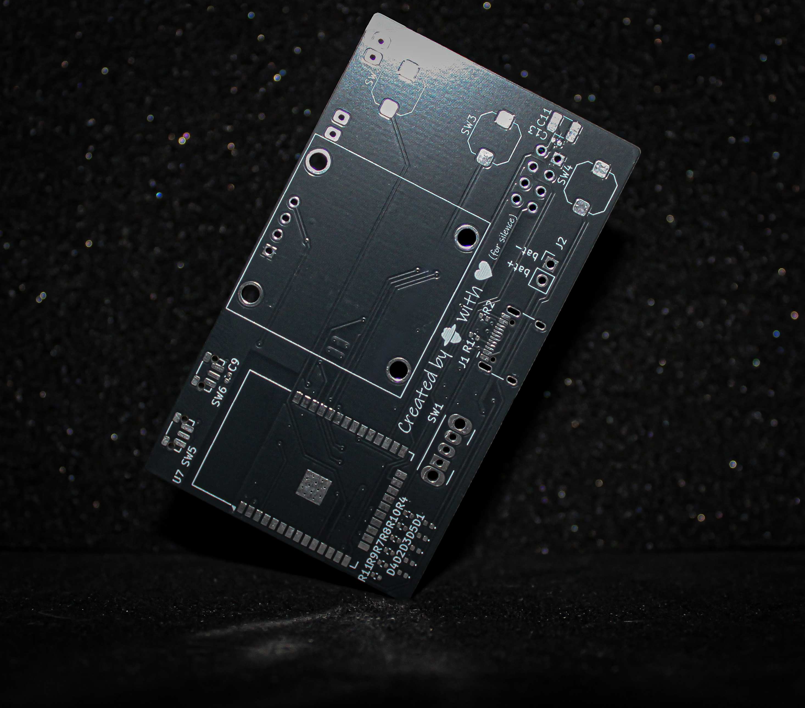
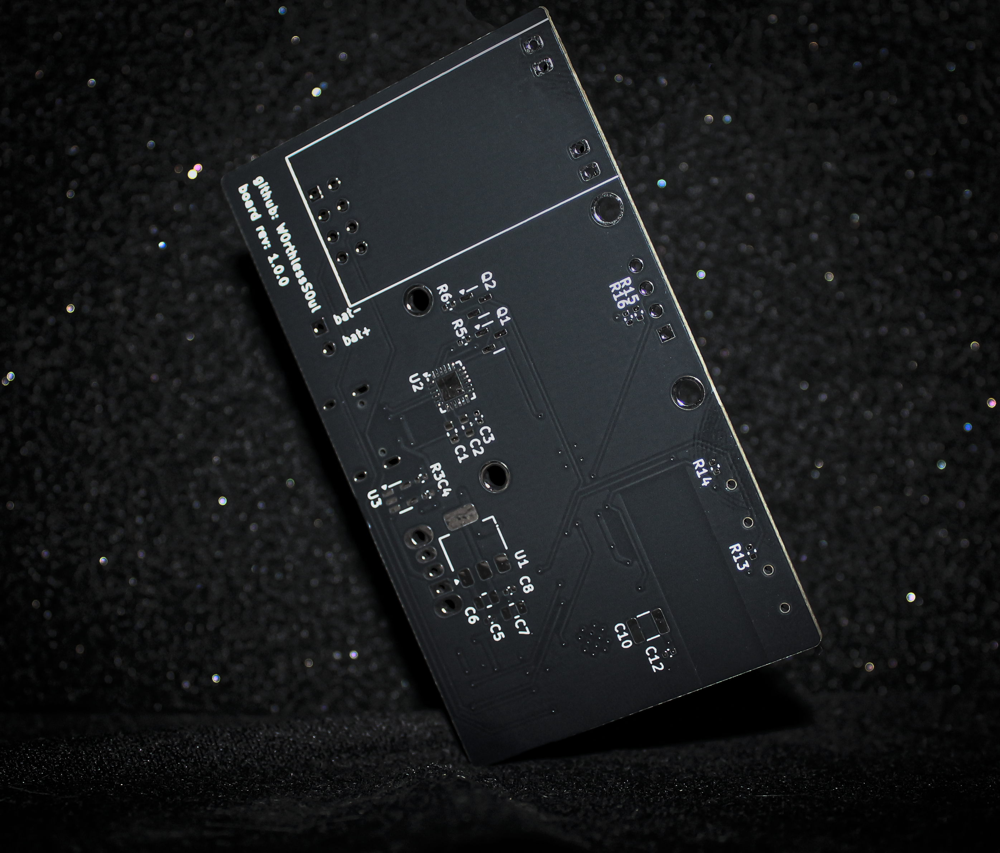
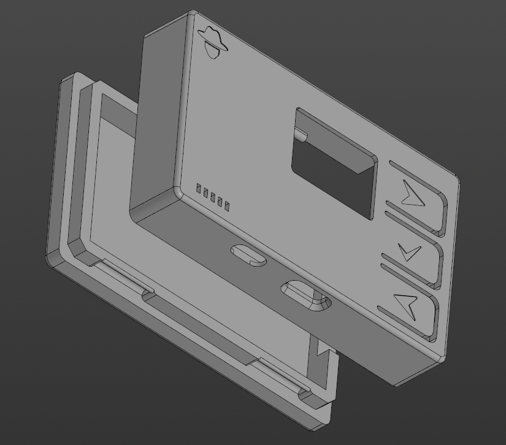
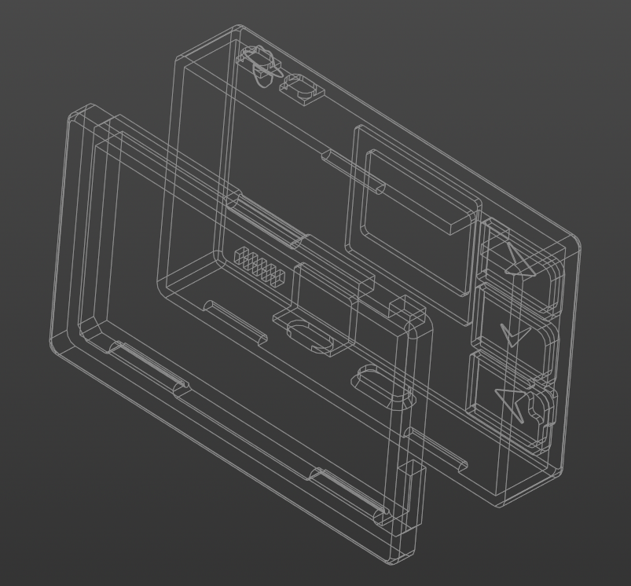
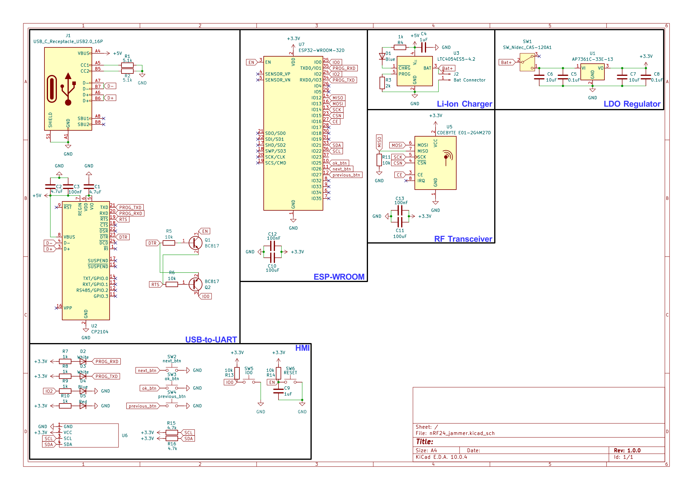

[⬅️ Back to Main Repository](/README.md)

# 📟 nRF24 Jammer Board (v1.0.0)

### Designed by [@W0rthlessS0ul](https://github.com/W0rthlessS0ul)

-----

## 📋 Board Specifications
* **MCU:** ESP-WROOM-32D
* **USB-to-UART:** CP2104
* **RF Modules:** One CDEBYTE E01-2G4M27D module
* **Display:** OLED 128x64
* **Controls:** 3 navigation buttons
* **Power Source:** 3.7V Li-Po battery with onboard Type-C charging circuit

-----

## ⚠️ Known Issues & Hardware Limitations

> **Please review the following hardware quirks of revision v1.0.0 before ordering and assembling:**

1. **Connected Battery Required (No Power Path):**  
   The board **cannot operate exclusively via USB Type-C without a battery connected**. It lacks a dedicated dynamic power-path management circuit. Without a battery, current is drawn directly through the onboard charging controller, which is capped at ~500mA. This is insufficient to handle simultaneous ESP32 transmission peaks and CDEBYTE module transmitting at full power, causing brownouts and bootloops
   
   👉 **A connected battery is strictly required for normal operation**
2. **Charging Status LED:**  
   In some instances, the charge status LED may remain dimly lit or fail to turn off completely even after the battery reaches full charge

-----

## 🖨️ 3D Enclosure

> **If you plan to use the 3D enclosure:**

- The case is specifically modeled for a **603450** Li-Po cell

-----

## 📸 Gallery

  <table>
    <tr>
      <td align="center"><b>PCB Front</b></td>
      <td align="center"><b>PCB Back</b></td>
    </tr>
    <tr>
      <td></td>
      <td></td>
    </tr>
    <tr>
      <td align="center"><b>3D Case (Solid)</b></td>
      <td align="center"><b>3D Case (X-Ray)</b></td>
    </tr>
    <tr>
      <td></td>
      <td></td>
    </tr>
  </table>

-----

## 📦 Files

| Resource | Description | Link |
| :--- | :--- | :---: |
| 🗜️ **Gerber Files** | Production-ready archive | [Download ZIP](gerber/nRF24_jammer.zip) |
| 📝 **BOM** | Bill of Materials | [View BOM](bom/nRF24_jammer.csv) |
| 📐 **Schematic** | Electrical schematic | [Download PDF](/schemes/W0rthlessS0ul/v1.0.0/nRF24_jammer.pdf) |
| 🛠️ **KiCad Project** | Full project files | [Open Directory](kicad/) |
| 🖨️ **3D Enclosure** | Printable case models | [Open Directory](enclosure/) |

-----

## 📐 Electrical Schematic

  <td></td>

