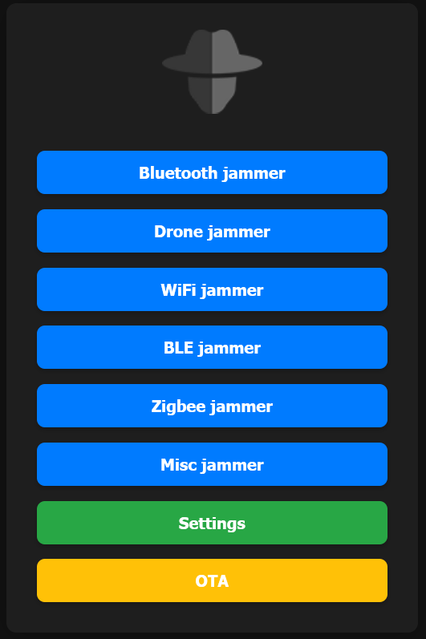
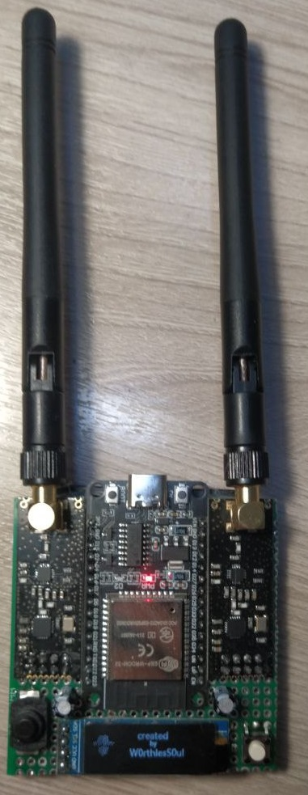
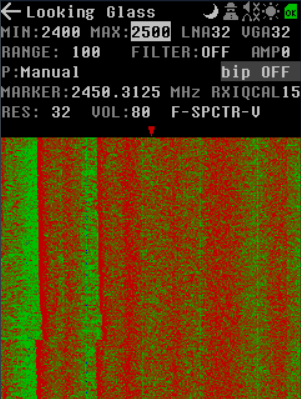
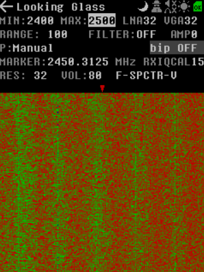
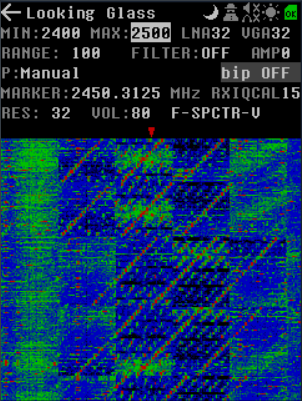
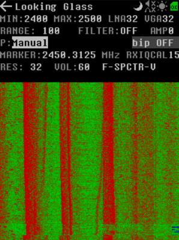
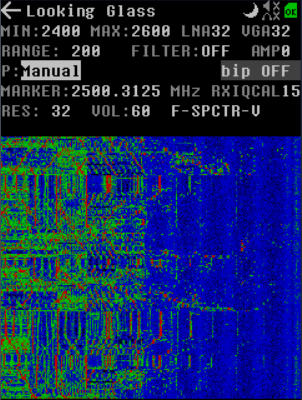

  
  <h1> 🌟 nRF24 Jammer 🌟 </h1>

Welcome to the **nRF24 Jammer** repository! 🎉 Dive into the world of RF interference with this unique project based on the ESP32 and NRF24 technology.

## 📚 Table of Contents
- [🚀 What Can You Do with This?](#-what-can-you-do-with-this)
- [📋 List of Components](#-list-of-components)
- [🧑‍🔧 Let's Get Started with Soldering!](#-lets-get-started-with-soldering)
- [📦 Flash Firmware](#-flash-firmware)
- [🤔 How to Use?](#-How-to-Use)
- [🌐 Web Interface](#-Web-Interface)
- [🎉 Final Outcome](#-final-outcome)
- [🌟 Example of Work](#-example-of-work)
- [❤️ Thank You for Your Support!](#-thank-you-for-your-support)
- [🌐 Follow Me for Updates](#-follow-me-for-updates)

-----

## 🚀 What Can You Do with This?
This amazing jammer is built on the **ESP32** architecture integrated with **two NRF24** modules. With its extraordinary capabilities, you can effectively disrupt signals across different technologies including:
- **Bluetooth** 🔊
- **BLE** 📱
- **Drones** 🚁
- **Wi-Fi** 📶
- **Zigbee**📡

-----

## 📋 List of Components
To bring this project to life, you will need the following components:
1. **Two NRF24L01+PA+LNA modules** 🛠️
2. **ESP32 (30 pins)** ⚙️
3. **Two 16V capacitors** rated at **100µF** 🔋
4. **128x32 or 128x64 OLED display** 📺
5. **Tactile button** 🔘

-----

## 🧑‍🔧 Let's Get Started with Soldering!

### HSPI Connection
| **Pin Name** | **ESP32 GPIO** | **Connection**       |
|--------------|----------------|----------------------|
| VCC          | 3.3V          | (+) capacitor        |
| GND          | GND           | (-) capacitor        |
| CE           | GPIO 16       |                      |
| CSN          | GPIO 15       |                      |
| SCK          | GPIO 14       |                      |
| MOSI         | GPIO 13       |                      |
| MISO         | GPIO 12       |                      |
| IRQ          |                |                      |

### VSPI Connection
| **Pin Name** | **ESP32 GPIO** | **Connection**       |
|--------------|----------------|----------------------|
| VCC          | 3.3V          | (+) capacitor        |
| GND          | GND           | (-) capacitor        |
| CE           | GPIO 22       |                      |
| CSN          | GPIO 21       |                      |
| SCK          | GPIO 18       |                      |
| MOSI         | GPIO 23       |                      |
| MISO         | GPIO 19       |                      |
| IRQ          |                |                      |

### OLED Connection
| **Pin Name** | **ESP32 GPIO** |
|--------------|----------------|
| VCC          | 3.3V          |
| GND          | GND           |
| SCL          | GPIO 22       |
| SDA          | GPIO 21       |

### Button Connection
| **Pin Name** | **ESP32 GPIO** |
|--------------|----------------|
| GND          | GND           |
|              | GPIO 25       |

-----

## 📦 Flash Firmware
Follow these steps to flash the firmware:
1. Download the firmware from the **releases** section that corresponds to your display.
2. Navigate to **ESPWebTool**: [ESPWebTool](https://esp.huhn.me/)
3. Arrange the files as per the table below:

| **Address** | **File Name**                             |
|-------------|-------------------------------------------|
| 0x1000      | nRF24_jammer_bootloader.bin              |
| 0x8000      | nRF24_jammer_partitions.bin              |
| 0x10000     | nRF24_jammer.bin                          |

4. Click "Flash," and once the installation is complete, **restart your board** and enjoy using your jammer!

-----

## 🤔 How to Use?

- **Next Selection**: `Press` the button once to move to the next item.
- **Select Menu Item**: `Press and hold` the button to activate the selected option.

-----

## 🌐 Web Interface

- To utilize the web interface, please follow the steps outlined below.
1. activate the **nRF24 jammer**.
2. Connect to the Wi-Fi network named `jammer` using the password `W0rthlessS0ul`.
3. open your web browser and navigate to the IP address `192.168.4.1`.
4. Now you can control your nRF24 jammer through an web interface.

-----

## 🎉 Final Outcome

### Normal Spectrum

### Bluetooth Jam Spectrum

### Drone Jam Spectrum

### Wi-Fi Jam Spectrum

### BLE Jam Spectrum

### Zigbee Jam Spectrum

-----

## 🌟 Example of Work
- Bluetooth jam

-----

## ❤️ Thank You for Your Support!
If you would like to support this project, please consider starring the repository or following me! If you appreciate the hard work that went into this, buying me a cup of coffee would keep me fueled! ☕ 

**BTC Address:** `3PpBpNs1wXkhA93g5tfpMf4qierz4m9BCW` (this is a **SegWit** address)

Every donation is greatly appreciated and contributes to the ongoing development of this project!

---

## 🌐 Follow Me for Updates
Stay connected to receive the latest updates:

