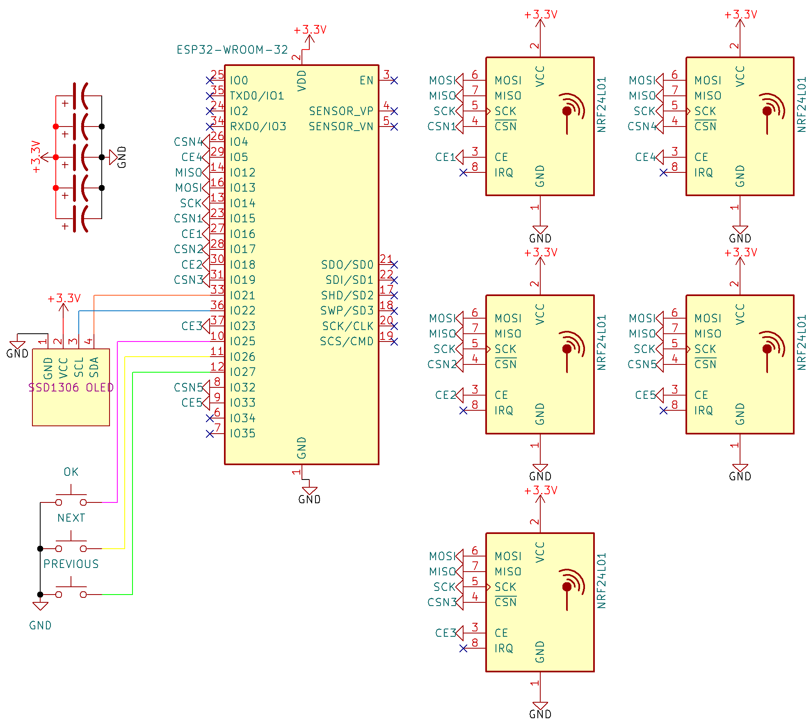
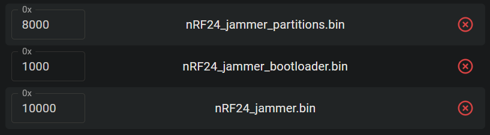
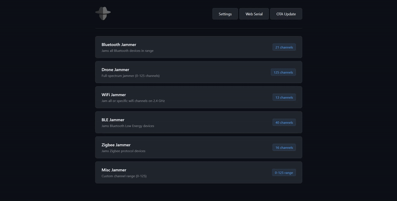
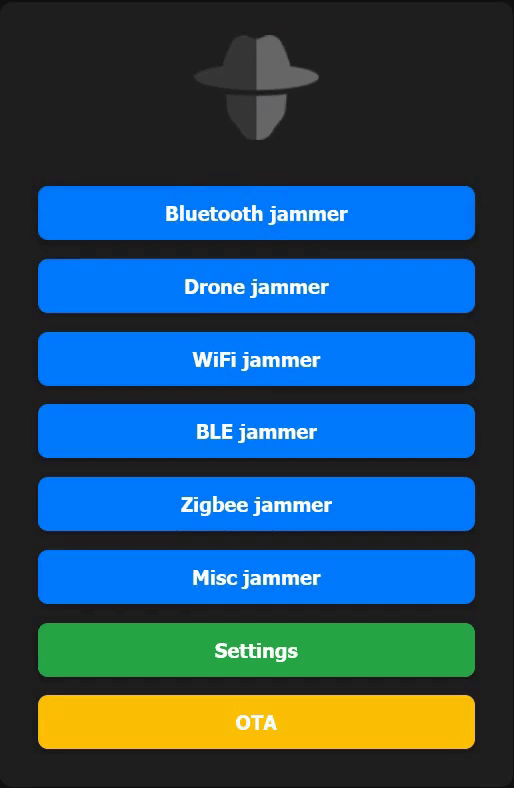
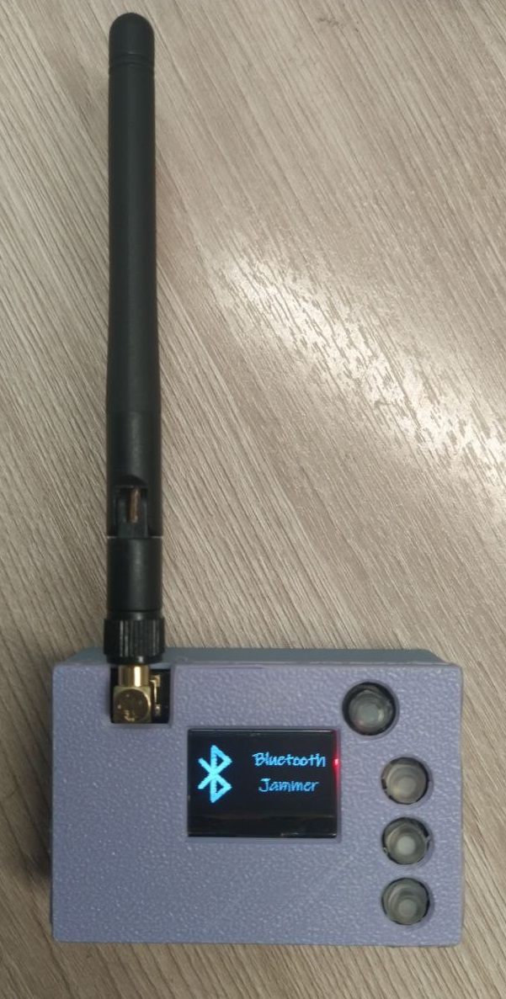

<div align="center">
  
  <h1> 🌟 nRF24 Jammer 🌟 </h1>
</div>

Welcome to the **nRF24 Jammer** repository! 🎉 Dive into the world of RF interference with this unique project based on the ESP32 and nRF24 technology.

## 📚 Table of Contents
- [🎯 Possible Additions](#-possible-additions)
- [🚀 What Can You Do with This?](#-what-can-you-do-with-this)
- [📋 List of Components](#-list-of-components)
- [🧑‍🔧 Let's Get Started with Soldering!](#-lets-get-started-with-soldering)
- [🛠️ Build From Source](#-build-from-source)
- [📦 Flash Firmware](#-flash-firmware)
- [🎮 Device Control](#-device-control)
- [🌐 Web Interface](#-Web-Interface)
- [🔌 Serial Interface](#-Serial-Interface)
- [🎉 Final Outcome](#-final-outcome)
- [🙏 Acknowledgments](#-acknowledgments)
- [🤝 Project Supporters](#-project-supporters)
- [❤️ Support the project](#-support-the-project)
- [⭐ Star History](#-star-history)

-----

## 🎯 Possible Additions
- **Deauthentication attack**
- **BLE spam**
- **Beacon spam**
- **nRF24 mousejack**

***`If you have the capability to assist with these features, please feel free to create pull requests!`***

-----

## 🚀 What Can You Do with This?
This amazing jammer is built on the **ESP32** architecture integrated with **configurable numbers of nRF24** modules. With its extraordinary capabilities, you can effectively disrupt signals across different technologies including:
- **Bluetooth** 🔊
- **BLE** 📱
- **Drones** 🚁
- **Wi-Fi** 📶
- **Zigbee**📡

-----

## 📋 List of Components
To bring this project to life, you will need the following components:
1. **nRF24L01+PA+LNA modules** 🛠️
2. **ESP-WROOM-32** ⚙️
3. **16V capacitors** rated at **100µF** 🔋
4. **128x32 or 128x64 OLED display** 📺 *(optional)*
5. **Tactile button** 🔘 *(optional)*

-----

## 🧑‍🔧 Let's Get Started with Soldering!

### Connecting First nRF24 module (**optional**)
| **Pin Name** | **ESP32 GPIO** | **Connection**       |
|--------------|----------------|----------------------|
| VCC          | 3.3V          | (+) capacitor        |
| GND          | GND           | (-) capacitor        |
| CE           | GPIO 16       |                      |
| CSN          | GPIO 15       |                      |
| SCK          | GPIO 14       |                      |
| MOSI         | GPIO 13       |                      |
| MISO         | GPIO 12       |                      |
| IRQ          |                |                      |

### Connecting Second nRF24 module (**optional**)
| **Pin Name** | **ESP32 GPIO** | **Connection**       |
|--------------|----------------|----------------------|
| VCC          | 3.3V          | (+) capacitor        |
| GND          | GND           | (-) capacitor        |
| CE           | GPIO 18       |                      |
| CSN          | GPIO 17       |                      |
| SCK          | GPIO 14       |                      |
| MOSI         | GPIO 13       |                      |
| MISO         | GPIO 12       |                      |
| IRQ          |                |                      |

### Connecting Third nRF24 module (**optional**)
| **Pin Name** | **ESP32 GPIO** | **Connection**       |
|--------------|----------------|----------------------|
| VCC          | 3.3V          | (+) capacitor        |
| GND          | GND           | (-) capacitor        |
| CE           | GPIO 23       |                      |
| CSN          | GPIO 19       |                      |
| SCK          | GPIO 14       |                      |
| MOSI         | GPIO 13       |                      |
| MISO         | GPIO 12       |                      |
| IRQ          |                |                      |

### Connecting Fourth nRF24 module (**optional**)
| **Pin Name** | **ESP32 GPIO** | **Connection**       |
|--------------|----------------|----------------------|
| VCC          | 3.3V          | (+) capacitor        |
| GND          | GND           | (-) capacitor        |
| CE           | GPIO 5        |                      |
| CSN          | GPIO 4        |                      |
| SCK          | GPIO 14       |                      |
| MOSI         | GPIO 13       |                      |
| MISO         | GPIO 12       |                      |
| IRQ          |                |                      |

### Connecting Fifth nRF24 module (**optional**)
| **Pin Name** | **ESP32 GPIO** | **Connection**       |
|--------------|----------------|----------------------|
| VCC          | 3.3V          | (+) capacitor        |
| GND          | GND           | (-) capacitor        |
| CE           | GPIO 33       |                      |
| CSN          | GPIO 32       |                      |
| SCK          | GPIO 14       |                      |
| MOSI         | GPIO 13       |                      |
| MISO         | GPIO 12       |                      |
| IRQ          |                |                      |

### OLED Connection (**optional**)
| **Pin Name** | **ESP32 GPIO** |
|--------------|----------------|
| VCC          | 3.3V          |
| GND          | GND           |
| SCL          | GPIO 22       |
| SDA          | GPIO 21       |

### Button Connection (**optional**)
| **Button Actions** | **ESP32 GPIO** |
|--------------|----------------|
| OK          | GPIO 25       |
| NEXT (Optional)             | GPIO 26       |
| PREVIOUS (Optional)            | GPIO 27       |



###### In all configurations the same SCK, MOSI, and MISO pins are used. This is not a mistake—SPI interfaces can share clock and data lines, while proper operation is ensured by separate control signals (CSN and CE)

-----

## 🛠️ Build From Source

#### This section is **addressed to contributors**. If you are a regular user of the project, you can skip it

1. Install **PlatformIO IDE** extension in **VS Code** 
2. Click the PlatformIO icon → Open → Open Project → select your project folder
3. Wait until all dependencies are installed
4. And now you can choose which project to compile in "PROJECT TASKS" or choose "Build all" to compile all kinds of firmware at once.
5. Output .bin files appear in: ```project_root/bin/[env_name]```


###### ⚠️ Important for source builds: Since v2.5.0, this project uses a modified RF24 library (see /lib).

-----

## 📦 Flash Firmware
<details>
<summary><strong>Manual Update</strong></summary>

<div style="margin-left: 20px;">

Follow these steps to flash the firmware:
1. Download the firmware from the **[releases](https://github.com/W0rthlessS0ul/nRF24_jammer/releases)** section that corresponds to your display
2. Navigate to **ESPWebTool**: [ESPWebTool](https://esp.huhn.me/)
3. Arrange the files as per the table below:

| **Address** | **File Name**                             |
|-------------|-------------------------------------------|
| 0x1000      | bootloader.bin              |
| 0x8000      | partitions.bin              |
| 0x10000     | firmware.bin                          |

4. Click "Flash," and once the installation is complete, **restart your board** and enjoy using your jammer!



</div>
</details>
<details>
<summary><strong>OTA Update</strong></summary>

<div style="margin-left: 20px;">

### This method can only be used if you have firmware version 1.9 or higher installed.
Follow these steps to flash the firmware:
1. Download the firmware from the **[releases](https://github.com/W0rthlessS0ul/nRF24_jammer/releases)** section that corresponds to your display
2. Turn on your device and open a web browser
3. Navigate to the web interface at **192.168.4.1**
4. Click on "**OTA**" and select the file "**firmware.bin**" (`⚠️️ make sure not to choose the bootloader or partitions files`)



</div>
</details>

-----

## 🎮 Device Control 

<details>
<summary><strong>🟢 1-Button Configuration</strong></summary>
<div style="margin-left: 20px;">

#### 📋 Menu Navigation
- **Short press** → Next menu item
- **Long press** → Select menu item

#### 📡 Misc Jammer
- **Short press** → Channel +1
- **Long press** → Continuous channel +1 (every 100ms)
- **Double press** → Select channel

</div>
</details>

<details>
<summary><strong>🔵 2-Button Configuration</strong></summary>
<div style="margin-left: 20px;">

#### 📋 Menu Navigation
- **Next button** short press → Next menu item
- **OK button** short press → Select menu item

#### 📡 Misc Jammer
- **Next button** short press → Channel +1
- **Next button** long press → Continuous channel +1 (every 100ms)
- **OK button** short press → Select channel

</div>
</details>

<details>
<summary><strong>🟣 3-Button Configuration</strong></summary>
<div style="margin-left: 20px;">

#### 📋 Menu Navigation
- **Next button** short press → Next menu item
- **Previous button** short press → Previous menu item
- **OK button** short press → Select menu item

#### 📡 Misc Jammer
- **Next button** short press → Channel +1
- **Next button** long press → Continuous channel +1 (every 100ms)
- **Previous button** short press → Channel -1
- **Previous button** long press → Continuous channel -1 (every 100ms)
- **OK button** short press → Select channel

</div>
</details>

-----

## 🌐 Web Interface

- To utilize the web interface, please follow the steps outlined below
1. activate the **nRF24 jammer**
2. Connect to the Wi-Fi network named `jammer` using the password `W0rthlessS0ul`
3. open your web browser and navigate to the IP address `192.168.4.1`
4. Now you can control your nRF24 jammer through an web interface



-----

## 🔌 Serial Interface

- To utilize the serial interface, please follow the steps outlined below
1. Activate the **nRF24 jammer**
2. Connect the device to a PC or phone via USB
3. You can use any serial terminals for control, for example: [spacehuhn terminal](https://terminal.spacehuhn.com/)
4. Now write **help** to get a list of commands


-----

## 🎉 Final Outcome



### Normal Spectrum


### Bluetooth Jam Spectrum


### Drone Jam Spectrum


### Wi-Fi Jam Spectrum


### BLE Jam Spectrum


### Zigbee Jam Spectrum


### Misc Jam Spectrum


-----

## 🙏 Acknowledgments
- [smoochiee](https://github.com/smoochiee) - **for the main logic of the jammer.**
- [samukas81](https://github.com/samukas81) - **for suggesting ideas.**

-----

## 🤝 Project Supporters

| **Supporter**                                  | **Contribution**|
|------------------------------------------------|-----------------|
|  [@sergey2735](https://github.com/sergey2735)  |    40.7 ADA     |

-----

## ❤️ Support the project
If you would like to support this project, please consider starring the repository or following me! If you appreciate the hard work that went into this, buying me a cup of coffee would keep me fueled! ☕ 

**BTC Address:** `bc1qvul4mlxxw5h2hnt8knnxdrxuwgpf4styyk20tm`

**ETH Address:** `0x5c54eAb2acFE1c6C866FB4b050d8B69CfB1138Af`

**LTC Address:** `LbdzCsYbxuD341raar6Cg1yKavaDq7fjuV`

**XRP Address:** `rKLLPzoBGfqY3pAQPwTFPRYaWjpHSwHNDw`

**ADA Address:** `addr1qyz2aku0ucmxqnl60lza23lkx2xha8zmxz9wqxnrtvpjysgy4mdcle3kvp8l5l7964rlvv5d06w9kvy2uqdxxkcryfqs7pajev`

**DOGE Address:** `DBzAvD62yQUkP4Cb7C5LuFYQEierF3D3oG`

<a href="https://nowpayments.io/donation?
  api_key=6370NCF-SXJ4MMC-N71CVMS-6G52PW9"
  target="_blank" rel="noreferrer noopener">
  
</a>

Every donation is greatly appreciated and contributes to the ongoing development of this project!

---

## ⭐ Star History

<a href="https://www.star-history.com/#W0rthlessS0ul/nRF24_jammer&type=date&legend=top-left">
 <picture>
   <source media="(prefers-color-scheme: dark)" srcset="https://api.star-history.com/svg?repos=W0rthlessS0ul/nRF24_jammer&type=date&theme=dark&legend=top-left" />
   <source media="(prefers-color-scheme: light)" srcset="https://api.star-history.com/svg?repos=W0rthlessS0ul/nRF24_jammer&type=date&legend=top-left" />
   
 </picture>
</a>
